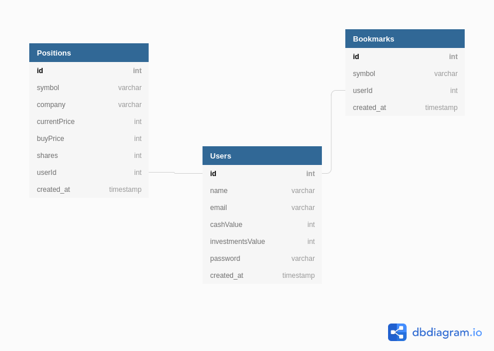

# robinhoodClone
## Database Diagram

## MVP (Minimum Viable Product)

    Dashboard + Portfolio
    Asset/Stock Detail
    Watchlist
    Asset/Stock Search

## User authentication

    Sign Up
    Login / Logout
    Demo User Login

## Front-end Technologies:

    React
    Redux
    Alpaca API  
    Polygon API (newsfeed)
    Alphavantage API (stock tickers)
    
## Backend Technologies:

    Express
    Sequelize
    
## Backend Routes:
    
    Users (user account management)
    - POST /api/users
    - POST /api/users/token
    
    Positions (shares at purchase price)
    - POST /api/positions (purchase positions)
    - GET /api/positions/ (get entire portfolio of positions for display in sidebar)
    - DELETE /api/positions/:id (sell entire position)
    - PATCH /api/positions/:id (sell some shares but not entire position)
    
    Watchlist (just bookmarked assets)
    - POST /api/bookmarks (add bookmarked asset to watchlist)
    - GET /api/bookmarks/ (get watchlist for display in sidebar)
    - DELETE /api/bookmarks/:id (delete bookmarked asset)
    
    
## Hopeful Bonus Features:

    Market News
    Unusual Market Activity
    News Sharing 

